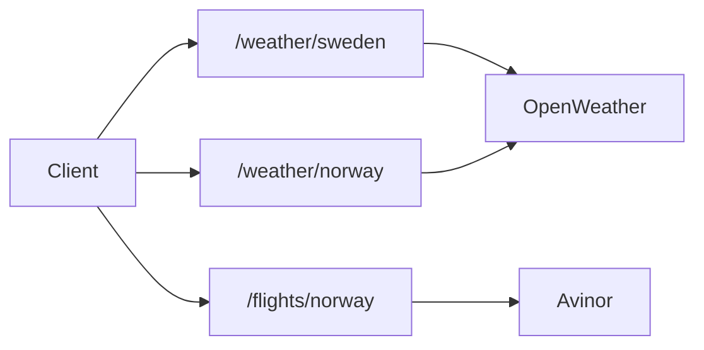

## Dynode (Zuplo Gateway)

Zuplo-managed edge API that serves **weather** (OpenWeather) and **Norway
flights** (Avinor), keyed by player datasets.

Created with [`create-zuplo-api`](https://zuplo.com/docs).

**Further reading**

- [REQUIREMENTS.md](REQUIREMENTS.md) — functional / non-functional requirements
- [INFRASTRUCTURE.md](INFRASTRUCTURE.md) — hosting, caches, upstreams, deploy

## Getting Started

```bash
npm run dev
```

Gateway: [http://localhost:9000](http://localhost:9000)  
Editor: port `9100`

Docs portal:

```bash
npm run docs
```

If ports `9000` / `9100` are in use on Windows:

```powershell
.\start-dev.ps1
```

### Environment

Copy `env.example` to `.env`:

| Variable | Required for | Notes |
| --- | --- | --- |
| `OPENWEATHER_API_KEY` | `/weather/*` | OpenWeather API key |
| Flights | `/flights/norway` | No API key (public Avinor XmlFeed) |

Deployed secrets are set in the Zuplo portal (not only in Git).

## Architecture

| Layer | Location |
| --- | --- |
| Routes | `config/routes.oas.json` |
| Policies | `config/policies.json` |
| Handlers / policies | `modules/` |
| Player data | `modules/players/` |
| Sample signage client | `samples/v1/` |
| Developer portal | `docs/` (Zudoku) |



## Player datasets

Country files under `modules/players/`:

| File | Used by |
| --- | --- |
| `sweden.ts` | `/weather/sweden` |
| `norway.ts` | `/weather/norway`, `/flights/norway` |
| `poland.ts` | `/weather/poland` |
| `test.ts` | Merged into **every** country lookup (demo/QA players) |

Shared helper: `createCountryPlayerLookup(countryRecords, testPlayerRecords)`.

Optional player fields:

- `Gate` — airport gate (flights)
- `IATA` — airport code (flights; e.g. `OSL`, `BGO`)

Demo/QA player IDs (always available):

| Player ID | Gate | IATA |
| --- | --- | --- |
| `759244535` | D9 | OSL |
| `582309742` | D1 | OSL |

Player id query aliases (weather + flights):

- `player`
- `resource_id`

## Weather

Shared OpenWeather handler; country-specific player datasets and caches
(**1 hour** TTL).

| Endpoint | Dataset | Reset |
| --- | --- | --- |
| `GET /weather/sweden` | Sweden + test | `POST /weather/sweden/reset` |
| `GET /weather/norway` | Norway + test | `POST /weather/norway/reset` |
| `GET /weather/poland` | Poland + test | `POST /weather/poland/reset` |

Parameters: `latlon`, `player` / `resource_id`,
`debug`, `format=json`, `filter=false`.

Default body is JavaScript: `data = {...};`.

## Flights Norway

`GET /flights/norway` — Avinor XmlFeed, filtered by gate. Cache **180 seconds**
(Avinor recommends refreshing about every 3 minutes).

Provide **either** `gate` **or** `player` / resource id — never both.

| Parameter | Description |
| --- | --- |
| `gate` | Gate filter (e.g. `D1`). Mutually exclusive with `player`. |
| `player` | Resolves `Gate` + `IATA` from Norway (+ test) players. |
| `iata` | Airport override (default player IATA, else `OSL`). Alias: `airport`. |
| `direction` | `D` departures (default) or `A` arrivals. |
| `debug` / `format` / `filter` | Same semantics as weather. |

Each flight may include `airportName` (city/airport label from Avinor
`airportNames`). Arrivals often lack matching gate codes; departures match
player gates more reliably.

Reset: `POST /flights/norway/reset`.

Attribution in responses: “Flight data from Avinor” → [avinor.no](https://www.avinor.no).

### Examples

```bash
GET /flights/norway?player=582309742&format=json
GET /flights/norway?gate=D9&iata=OSL&direction=D&format=json
GET /weather/norway?player=582309742&format=json
GET /weather/sweden?player=582607705&format=json
GET /weather/poland?player=963988113&format=json
```

## Sample client (`samples/v1`)

1080×1920 portrait signage board, also served from the docs portal at
`/samples/v1/index.html`:

| File | Role |
| --- | --- |
| `index.html` | Markup |
| `styles.css` | Layout |
| `app.js` | Loads gateway data and renders next departure/arrival |

At runtime the sample reads `player` or `resource_id`
from the page URL and requests:

```text
https://dynode-main-8eca196.zuplo.app/flights/norway?resource_id=759244535
```

Example docs URL:

```text
/samples/v1/index.html?resource_id=759244535&direction=D
```

Optional query: `direction=A` or `D`, `refresh=180` (seconds), `api=` (override
gateway base URL).

## Project layout (key paths)

```text
config/routes.oas.json      OpenAPI + x-zuplo-route wiring
config/policies.json        Cache + normalize policies
modules/weather-handler.ts  Shared weather factory
modules/avinor-xml.ts       Avinor feed + airport names
modules/players/            Country + test player data
samples/v1/                 Signage sample
docs/                       Zudoku developer portal
zuplo.jsonc                 Zuplo project metadata
```

## Learn More

- [REQUIREMENTS.md](REQUIREMENTS.md)
- [INFRASTRUCTURE.md](INFRASTRUCTURE.md)
- [Zuplo documentation](https://zuplo.com/docs)
- [Discord](https://discord.zuplo.com)
